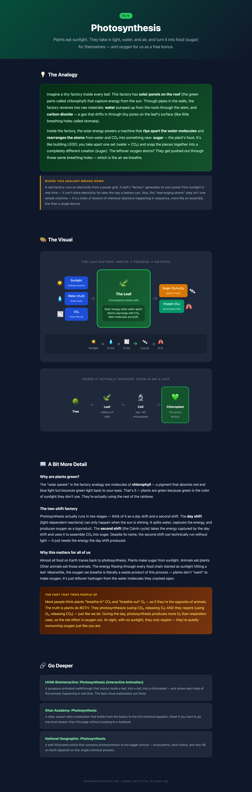
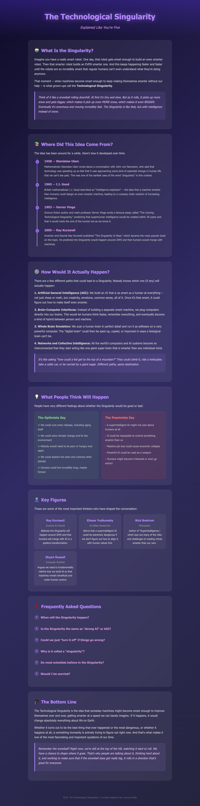

# claude-skills

[](LICENSE)
[](#skills)
[](#rules)
[](https://docs.anthropic.com/en/docs/claude-code)

Claude Code skills and rules for self-improving workflows -- feedback loops, learning tools, and creative comparison.

## Skills

| Skill | Description |
|-------|-------------|
| [`/feedback`](#feedback) | A mirror for your workflow -- 5/5/5 reports that track what's improving, escalate what isn't, and turn advice into automation |
| [`/skill-battle`](#skill-battle) | Run multiple skills on the same task in parallel, compare side by side |
| [`/eli5`](#eli5) | Make the complex simple -- research-backed explainer pages with analogies, visuals, and layered detail that open in your browser |

## Rules

| Rule | Description |
|------|-------------|
| [`active-context-header`](#active-context-header-1) | Adds a visible status line to every response showing which skill or mode is active |

> Rules are not yet distributable via the plugin system ([tracking issue](https://github.com/anthropics/claude-code/issues/14200)). Install manually for now.

## Install

### Skills

```bash
# Add the marketplace
claude plugin marketplace add bwitlin/claude-skills

# Install individual skills
claude plugin install feedback@bwitlin-claude-skills
claude plugin install skill-battle@bwitlin-claude-skills
claude plugin install eli5@bwitlin-claude-skills
```

<details>
<summary>Manual install (alternative)</summary>

```bash
git clone https://github.com/bwitlin/claude-skills.git ~/.claude/local-plugins/claude-skills
mkdir -p ~/.claude/skills

# Link whichever skills you want
ln -sf ~/.claude/local-plugins/claude-skills/plugins/feedback/skills/feedback ~/.claude/skills/feedback
ln -sf ~/.claude/local-plugins/claude-skills/plugins/skill-battle/skills/skill-battle ~/.claude/skills/skill-battle
ln -sf ~/.claude/local-plugins/claude-skills/plugins/eli5/skills/eli5 ~/.claude/skills/eli5
```
</details>

> **Note:** Skills won't appear until your next Claude Code session. If a slash command doesn't work immediately, restart Claude Code.

### Rules

```bash
# Clone the repo (if you haven't already)
git clone https://github.com/bwitlin/claude-skills.git ~/.claude/local-plugins/claude-skills

# Copy rules you want (project-level)
mkdir -p .claude/rules
cp ~/.claude/local-plugins/claude-skills/rules/active-context-header/active-context-header.md .claude/rules/

# Or install globally (all projects)
mkdir -p ~/.claude/rules
cp ~/.claude/local-plugins/claude-skills/rules/active-context-header/active-context-header.md ~/.claude/rules/
```

---

## /feedback

A structured self-assessment skill for Claude Code. It reads your git history, memory files, checkpoints, and project state, then delivers an honest **5/5/5 report**: 5 things going well, 5 things not going well, 5 things to improve. Every finding cites specific evidence -- commit hashes, file counts, timestamps. No vibes.

The first run is useful. The second run is where it gets interesting. The skill tracks trends across sessions, so every finding is labeled: **new**, **improving**, **stable**, or **regressing**. Items that don't improve get escalated -- not repeated. After 3 rounds of the same advice, the skill stops suggesting willpower and starts proposing hooks, scheduled tasks, or rule changes.

### What this looks like in practice

Over 7 feedback sessions on a real workspace:

- **37 unique findings tracked.** Each one labeled with a trend and compared against every prior session.
- **Late-night commits tracked from 1:29 AM down to 11:32 PM** over 5 sessions. The skill flagged it, proposed a scheduled reminder, then flagged the reminder's timing when it didn't work. The structural fix kept getting refined until the behavior actually changed.
- **A deferred cleanup task was flagged 6 consecutive sessions.** Session 1: "do this." Session 3: "schedule a calendar block." Session 5: "this is the last round of this advice -- decision required." Session 7: it got done.
- **One session resolved all 5 recommendations in a single sitting** -- TASKS.md rewrite, file commits, scheduled task adjustment, stale index archived, full memory sweep with 6 rule promotions. The skill generated real work output, not just a report to read and forget.

The skill distinguishes between **literacy gaps** (you don't know a tool exists) and **discipline gaps** (you know but didn't use it). Literacy gaps get teaching. Discipline gaps get automation. Different problems, different fixes. Getting this wrong wastes time -- repeating instructions to someone who already knows, or building guardrails when someone just needs a walkthrough.

### Usage

```
/feedback          # Last 48 hours (default)
/feedback 24h      # Last 24 hours
/feedback 7d       # Last 7 days
/feedback 2w       # Last 2 weeks
```

### What it looks for

- **Git history** -- commit patterns, categories (feat/fix/chore), late-night work
- **Checkpoints** -- session boundary discipline, handoff quality
- **Memory files** -- new memories created in the review window
- **Project state** -- TASKS.md, incident-log.md, uncommitted changes
- **Previous feedback sessions** -- trend comparison across every prior run
- **Fresh documentation** (optional, requires [Context7 MCP](https://context7.com)) -- pulls current Claude Code and gstack docs at analysis time so recommendations reflect what actually exists, not stale knowledge

### How it escalates

The skill doesn't just repeat itself. When the same item appears across multiple sessions:

| Sessions flagged | What happens |
|-----------------|--------------|
| 1 | Recommendation with specific action |
| 2 | Escalated language, deadline proposed |
| 3+ | Structural fix proposed (hook, scheduled task, rule change) |
| 5+ | "This is the last round of this advice -- decision required" |

### Output

Reports are displayed in chat and saved to `.context/feedback-sessions/` for trend tracking. After presenting findings, the skill asks for your reaction -- corrections are acknowledged directly and saved alongside the report.

### Optional enhancements

The fresh documentation feature requires the Context7 MCP server. Without it, the skill still works but skips doc-checking and only recommends based on what it observes in your project.

- **Context7 MCP** -- Powers fresh documentation lookup. The skill queries current Claude Code docs before writing recommendations so it catches new features you might not know about. Install from [context7.com](https://context7.com).
- **gstack** -- If installed (`~/.gstack/`), the skill also scans checkpoint history and skill changelog for additional evidence. Install from [github.com/garrytan/gstack](https://github.com/garrytan/gstack).

---

## /skill-battle

A creative pitch room for Claude Code. Give it a task, and it finds multiple skills -- yours and ones from trusted community repos -- to tackle it independently in parallel. You compare outputs side by side and pick the best parts.

Think of it like briefing three different agencies on the same project. You get three different takes. You decide what ships.

Also useful for **split testing** -- generate multiple variants of headlines, email copy, or ad creative, then plug the best ones into your testing tool.

### Usage

```
/skill-battle Write a creative brief for our new product launch
/skill-battle Draft 3 variants of cold outreach emails
/skill-battle Create landing page headline options for split testing
```

### What it does

1. **Captures your task** from the conversation or your prompt
2. **Discovers skills** -- scans your installed skills and searches trusted community repos (awesome-claude-code, awesome-claude-skills, superpowers, claude-plugins-official)
3. **Checks trust and risk** for external skills -- star count, last update, license, plus a doc review for scripts, file writes, network calls, and config changes
4. **You pick your fighters** -- choose which skills enter the battle
5. **Runs them all in parallel** -- each skill tackles the task independently
6. **Compares outputs** side by side with a summary of each skill's approach
7. **Cleans up** -- external skills installed for the battle can be kept or removed, per skill

### Before you use this

Skill-battle is fun and it works. Here are the things worth knowing before you go deep:

**Use it for the right stuff.** This is built for subjective work where different angles help: copy, briefs, strategy, outreach, positioning, split test variants. If there's one right answer (bug fix, migration, config change), just use the right skill directly.

**Each skill costs a full run.** Running 4 skills means 4x the tokens. For a creative brief, that's a few dollars well spent. For every task in your day, your bill will feel it.

**External skills are code from the internet.** Skill-battle checks star count, recency, and license. It reads the docs and flags what the skill does (scripts, file writes, API calls, config changes). You see the risk level before you install anything. But you are the last gate. If something looks off, don't install it.

**Clean up after yourself.** After a battle, the skill asks which external installs to keep and which to remove. The best performer is flagged. Keep the winners, remove the rest. Don't let skills pile up.

### Requirements

- Claude Code (CLI or Desktop)
- `gh` CLI for external skill trust assessment -- [install here](https://cli.github.com/)
- Subagent support (for parallel execution)

---

## /eli5

Explain Like I'm Five -- but not literally. This skill takes any concept and produces a single, self-contained HTML page that breaks it down with a concrete analogy, embedded CSS diagrams, layered detail, and curated links to go deeper. It opens in your browser. One page, everything together.

The teaching approach is grounded in real pedagogy -- cognitive load theory (never more than 4 new ideas at once), Gentner's structure mapping (analogies that map structurally, not just superficially), and Vygotsky's scaffolding (start from what you already know). Every analogy includes a "where this breaks down" note, because the #1 cause of analogy-induced misconceptions is not marking the boundary.

It's not for children. It's for adults who want the intuition -- the "ohh, that makes sense" moment -- without wading through a textbook first.

### Example outputs

<table>
<tr>
<td align="center"><strong>Photosynthesis</strong></td>
<td align="center"><strong>The Singularity</strong></td>
</tr>
<tr>
<td><a href="examples/eli5-photosynthesis.html"></a></td>
<td><a href="examples/eli5-singularity.html"></a></td>
</tr>
</table>

### Usage

```
/eli5 What is a blockchain and why do people care?
/eli5 explain machine learning to me
ELI5 what does async/await actually do?
What even is Kubernetes?     # triggers automatically
```

Works with anything -- tech concepts, science, code snippets, your own codebase. If you paste code and ask "what does this do?", the skill reads it, builds an analogy around it, maps each line back to the analogy, and produces a visual showing the flow.

### What you get

A dark-mode HTML page with:

- **One-liner** -- the gist in a single sentence
- **Core analogy** -- a mini-story using something you already understand, with an explicit "where this breaks down" note
- **Embedded visual** -- a CSS diagram (no Mermaid, no tldraw, no external deps) that shows structure or flow the text can't convey alone
- **More detail** -- real terminology introduced by tying it back to the analogy, plus a "the part that trips people up" misconception callout
- **Go deeper** -- 2-4 curated links with one-sentence reasons why each is worth clicking

### Eval results

The skill includes an eval suite (`plugins/eli5/evals/evals.json`) that tests three scenarios: a broad concept (blockchain), code explanation (async/await), and an abstract topic (machine learning). Each is run with and without the skill to measure the difference. Run evals locally to verify quality after changes.

### What it doesn't do

It doesn't try to make you an expert. The goal is Bloom's levels 1-2: can you recall the core idea and explain it in your own words? If you want to apply, analyze, or build -- that's a different ask, and the "Go Deeper" links point you there.

## active-context-header

A communication rule that adds a visible status line to every Claude Code response showing which skill, mode, or context is currently active. When Claude switches between skills, the header announces the transition with a one-line description.

### What it looks like

```
> /code-review

Looking at the diff, there's an N+1 query on line 47...
```

On transitions:

```
> **Switching** from **/code-review** to **/debug**
> **/debug** -- *Structured debugging with root cause investigation.*

Starting with the stack trace you pasted...
```

When no skill is active, it shows `> Claude`.

Useful during long sessions where multiple skills or workflows are used. You always know what mode Claude is operating in.

## License

MIT
