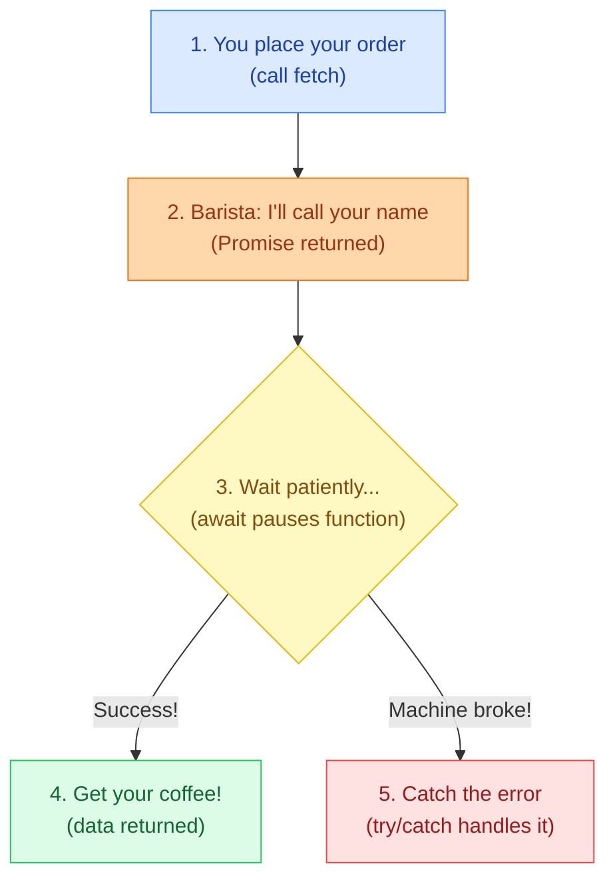

# ELI5: What Does async/await Actually Do?

## The One-Liner

**`async/await` lets you write code that waits for slow things (like fetching data from a server) without freezing your entire program -- it pauses just that one function while everything else keeps running.**

---

## The Analogy: The Coffee Shop

Imagine you walk into a busy coffee shop.

You step up to the counter and place your order -- a latte with oat milk. The barista says, "Got it, I'll call your name when it's ready." That right there is a **Promise** -- the barista is promising you that coffee is coming, just not this instant. You don't stand at the register blocking everyone behind you. You step aside and wait. That's **`await`** -- your function steps aside and pauses, letting other things happen while it waits. Meanwhile, the coffee shop keeps running: other customers order, the cashier keeps taking payments, the world doesn't freeze. Then the barista calls your name: "Latte for you!" The promise has been **resolved** -- you now have your actual data (the coffee). You take it and go on with your day.

But what if the espresso machine breaks? The barista comes over and says, "Sorry, we can't make your drink." That's an **error**, and the `try/catch` block is you being prepared for that -- instead of standing there confused forever, you hear about the problem and can decide what to do next.

**Where this analogy breaks down:** In a real coffee shop, you physically wait in one place. In JavaScript, `await` doesn't block the whole program -- it only pauses the specific `async` function. The rest of your code (other functions, event listeners, UI updates) keeps running, more like a coffee shop where you can somehow be in two places at once.

---

## The Visual



A Mermaid diagram was generated to visualize the flow. You can paste the code block above into any Mermaid-compatible renderer (GitHub markdown, Notion, [Mermaid Live Editor](https://mermaid.live)) to see the visual. A tldraw canvas was attempted but the MCP server was unresponsive during this session.

---

## A Bit More Detail

Now let's map the analogy back to your actual code, line by line:

```javascript
async function fetchUserData(userId) {
```
The `async` keyword is you walking into the coffee shop. It tells JavaScript: "This function is going to do something that takes time, and it might need to wait for results." Under the hood, it also means this function automatically returns a Promise -- even if you just write `return data`, callers receive a Promise that resolves to `data`.

```javascript
  const response = await fetch(`/api/users/${userId}`);
```
This is placing your order. `fetch()` sends a request to the server and immediately hands back a Promise (the barista saying "I'll call your name"). The `await` keyword is the critical part -- it tells the function: "Pause right here. Don't move to the next line until that Promise resolves." While this function is paused, the rest of your program keeps running normally.

```javascript
  const data = await response.json();
```
Once you have the response, you need to parse it. `.json()` also returns a Promise (like the barista needing a second to put the lid on your drink), so you `await` again. When it resolves, `data` now holds the actual JavaScript object -- your coffee is in hand.

```javascript
  return data;
```
You walk out of the coffee shop with your latte. The function returns the data to whoever called it.

```javascript
  } catch (error) {
    console.error('Failed to fetch user:', error);
    throw error;
  }
```
The `try/catch` wrapping the whole thing is your safety net. If the server is down, if the network fails, if the response isn't valid JSON -- any of those "espresso machine broke" scenarios -- execution jumps straight to `catch`. You log what went wrong, then `throw error` passes the problem up to whoever called this function so they can handle it too (maybe show an error message to the user).

### The part that trips people up

Many people confuse `async/await` with making code "synchronous." It doesn't. Your function **looks** like it runs top-to-bottom like synchronous code, and that's the whole point -- readability. But under the hood, the JavaScript engine is actually doing complex Promise-based scheduling. The `await` keyword doesn't freeze the program; it only pauses that specific function and yields control back to the event loop. This is why `async/await` is called "syntactic sugar" over Promises -- it's the same mechanism with a much nicer surface.

---

## Go Deeper

- [javascript.info -- async/await](https://javascript.info/async-await) -- One of the clearest written tutorials on async/await with interactive code examples you can edit and run right in the browser. Starts from basics and builds up.

- [freeCodeCamp -- Async and Await Explained by Making Pizza](https://www.freecodecamp.org/news/async-await-javascript-tutorial-explained-by-making-pizza/) -- Uses a pizza-making analogy (similar to the coffee shop idea) with step-by-step code walkthroughs. Good for solidifying the mental model with a second analogy.

- [MDN Web Docs -- How to use Promises](https://developer.mozilla.org/en-US/docs/Learn/JavaScript/Asynchronous/Async_await) -- The canonical reference. Denser, but thorough and authoritative. Come here once the concept clicks and you want the precise technical details.

- [The Odin Project -- Async and Await lesson](https://www.theodinproject.com/lessons/node-path-javascript-async-and-await) -- Part of a structured curriculum that builds up from callbacks to promises to async/await, so you see the full evolution and understand why async/await exists.
