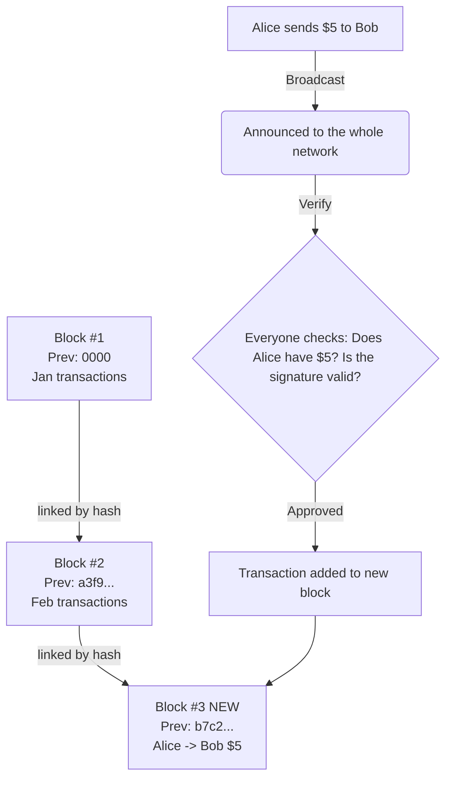

# ELI5: What Is a Blockchain and Why Do People Care About It?

## The One-Liner

A blockchain is a shared notebook that everyone can read but nobody can secretly edit, so people can agree on what happened without trusting a single person to keep the records honest.

## The Analogy

Imagine you and twenty friends want to keep track of who owes who money, but none of you trust any single person to hold the notebook. So you make a rule: **everyone gets their own copy of the notebook.** Whenever someone pays someone else, they stand up and announce it to the whole room. Everyone checks that the person actually has the money to spend, and if the room agrees, everyone writes the same line into their own notebook at the same time. The entries are written in permanent ink, and each new page includes a unique stamp based on the previous page -- so if anyone tried to go back and change an old entry, the stamps on all the later pages would no longer match, and everyone else's copies would prove the tampering immediately.

That's a blockchain: thousands of computers, each holding an identical copy of a ledger, adding new "pages" (blocks) of transactions together, with each page cryptographically chained to the one before it.

**Where this analogy breaks down:** In a real blockchain, the "agreement" process isn't as simple as people raising their hands. It uses computationally expensive puzzles (proof of work) or stake-based voting (proof of stake) to prevent anyone from flooding the system with fake approvals. The math is more involved than a room vote, but the intuition -- collective agreement before writing -- holds.

## The Visual

A tldraw diagram was created to illustrate this concept. The code is saved in `tldraw_code.js` in this outputs folder.

The visual shows three rows:

- **Top row (flow):** Alice's transaction gets broadcast to the network (cloud shape), then everyone verifies it (diamond decision shape), and it flows down into a new block.
- **Middle row (the chain):** Three blocks linked together by green arrows. Each block contains a reference to the previous block's "hash" -- that cryptographic stamp. Block #3 is highlighted in blue as the newly added block containing Alice's transaction.
- **Bottom row (why it matters):** Three properties that make people care -- no middleman needed, tamper-proof records, and full transparency since everyone holds a copy.

The diagram is also expressed as a Mermaid flowchart:

## A Bit More Detail

**The "block" part.** Transactions don't get recorded one at a time -- they're bundled into groups called blocks. Think of a block as one page of the shared notebook. A new block gets created roughly every 10 minutes on Bitcoin (other blockchains use different intervals). Each block holds hundreds or thousands of transactions.

**The "chain" part.** Every block includes a *hash* -- a mathematical fingerprint -- of the block before it. That hash is like the unique stamp in the analogy. If you change even one character in an old block, its hash changes completely, which breaks the link to the next block, which breaks the link to the one after that, all the way to the present. This cascading breakage is what makes the history tamper-proof. It's not just hard to rewrite the past -- it's computationally infeasible, because you'd have to redo all the work for every block that came after the one you changed, faster than the rest of the network is adding new blocks.

**The "distributed" part.** There's no single server holding "the" blockchain. Thousands of computers (called nodes) around the world each maintain their own complete copy. When a new block is proposed, the network has to reach *consensus* -- agreement that this block is valid. This is the key innovation: you get reliable record-keeping without needing to trust any individual participant, because cheating would require overpowering the majority of the network simultaneously.

> **The part that trips people up:** People often confuse "blockchain" with "cryptocurrency." A blockchain is the underlying technology -- the shared, tamper-proof ledger. Cryptocurrency (like Bitcoin or Ethereum) is one *application* of that technology, where the ledger tracks who owns digital coins. But blockchains can track anything: property deeds, supply chain steps, medical records, votes. The technology is more general than the financial hype suggests.

## Why People Care

People are excited about blockchains for a few core reasons, and skeptical for a few others:

**The promise:**
- **Removing middlemen.** Banks, notaries, escrow services -- they all exist because two strangers need a trusted third party. Blockchains replace that trust with math and consensus.
- **Censorship resistance.** No single government or company can alter the record or shut it down, because the data lives across thousands of independent machines.
- **Programmable agreements.** On platforms like Ethereum, you can write "smart contracts" -- code that executes automatically when conditions are met (e.g., release payment when a package is delivered). This turns the blockchain into a programmable, trustless computer.

**The honest caveats:**
- Blockchains are slow and energy-intensive compared to a normal database. If you already trust the record-keeper (like your bank), a blockchain adds complexity without clear benefit.
- The technology is genuinely hard to scale. Most blockchains process far fewer transactions per second than Visa or Mastercard.
- The space has attracted significant speculation and fraud alongside legitimate innovation. Separating the useful technology from the hype takes work.

## Go Deeper

- **[3Blue1Brown: "But how does bitcoin actually work?"](https://www.3blue1brown.com/lessons/bitcoin)** -- A 26-minute animated video that builds the concept of cryptocurrency from first principles. If you want to understand the cryptographic mechanics (hashing, digital signatures, proof of work) without a CS degree, this is the single best resource available.

- **[Anders Brownworth's Blockchain Visual Demo](https://github.com/anders94/blockchain-demo)** -- An interactive web tool where you can type data into blocks, mine them, and watch what happens when you tamper with an earlier block. Seeing the chain break in real time makes the concept click in a way that reading about it cannot.

- **[Blockchain 101 visual demo video](https://andersbrownworth.com/)** -- Anders Brownworth's accompanying 17-minute video walks you through his interactive demo step by step -- from a single hash to a full distributed blockchain. Excellent companion to the interactive tool above.
