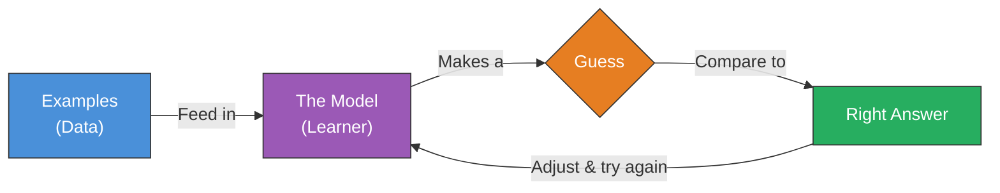

# ELI5: What Is Machine Learning?

## The One-Liner

Machine learning is how we get computers to learn from examples instead of being told exactly what to do.

## The Analogy

Imagine you're teaching a toddler to recognize animals. You don't sit them down and say, "A cat is a small quadruped mammal of the family Felidae with retractable claws and a digitigrade gait." That would be insane. Instead, you point at things: "Cat. Cat. Dog. Cat. Dog. Dog." At first, the kid gets it wrong a lot -- maybe they call every four-legged thing a dog. But each time they guess wrong, you correct them: "Nope, that's a cat -- see the pointy ears?" After enough examples and corrections, something clicks. They can spot cats they've never seen before, in poses they've never seen, wearing tiny hats they've never seen. They didn't memorize a rulebook. They *learned the pattern*.

Machine learning is that same process, except the "toddler" is a computer program, the "pointing at animals" is feeding it thousands of labeled examples, and the "correction" is a mathematical adjustment that nudges the program to be slightly less wrong next time.

**Where this analogy breaks down:** A toddler builds rich, flexible understanding -- they know cats are soft, alive, and might scratch you. A machine learning model knows none of that. It only learns the narrow pattern you train it on. Show a cat-recognizer a drawing of a cat and it might fail completely, because drawings weren't in its examples. The model has no common sense beyond its training data.

## The Visual

**Reading the diagram:** Data (examples) flows into the model. The model makes a guess. That guess gets compared to the right answer. Based on how wrong it was, the model adjusts itself -- then the whole loop repeats. Thousands of times. Millions, sometimes. Each lap around the loop, the guesses get a little better. That's the entire secret.

A tldraw canvas version of this diagram was also created -- the code is saved in `tldraw_code.js` in this directory. The tldraw MCP timed out during rendering, but the code can be pasted into any tldraw canvas to produce the visual.

## A Bit More Detail

That feedback loop in the diagram has a name: **training**. When you hear someone say they're "training a model," they mean they're running that guess-check-adjust cycle over and over on a large dataset until the model gets reliably good at the task.

The "model" itself is essentially a big mathematical function with thousands (or billions) of adjustable knobs, called **parameters** or **weights**. At the start, those knobs are set randomly -- the model is basically guessing at random. Each time it gets something wrong, the training process turns those knobs slightly to make that particular mistake less likely. The process of figuring out *which* knobs to turn and *how far* is called **gradient descent** -- but that's a topic for another day. The key intuition: the model improves by making lots of small adjustments, not by having one big "aha" moment.

Here's where the term "machine learning" finally clicks into place: traditional programming means a human writes explicit rules ("if the email contains 'Nigerian prince,' mark it as spam"). Machine learning means the computer figures out its own rules by studying examples. You don't tell it what spam looks like -- you show it 10,000 spam emails and 10,000 normal emails, and it figures out the patterns itself. That's the "learning" part.

**The part that trips people up:** People often confuse machine learning with artificial intelligence. Machine learning is one *technique* within the broader field of AI. Not all AI uses machine learning (some AI systems are just hand-coded rules), and not all machine learning is trying to make something "intelligent." A spam filter is machine learning. A recommendation engine suggesting your next Netflix show is machine learning. They're useful, but nobody would call them intelligent. When people talk about "AI" in the news, they usually mean the most dramatic end of machine learning -- large language models, image generators -- but that's just the flashiest corner of a much bigger toolbox.

## Go Deeper

- **[But what *is* a Neural Network? -- 3Blue1Brown](https://www.3blue1brown.com/lessons/neural-networks)** -- This ~20-minute animated video is one of the best visual explanations of how the most popular type of machine learning model actually works under the hood. Grant Sanderson's animations make the math genuinely intuitive.

- **[Google's Teachable Machine](https://teachablemachine.withgoogle.com/)** -- Train your own machine learning model in under 5 minutes, right in your browser, with zero code. Point your webcam at objects and watch the model learn to recognize them in real time. This is the fastest way to feel what machine learning actually *does*.

- **[TensorFlow Playground](https://playground.tensorflow.org/)** -- An interactive visualization where you can tweak a neural network and watch it learn to classify data points in real time. Lets you experiment with how the number of layers and neurons changes what the model can learn.

- **[Machine Learning Roadmap (Coursera)](https://www.coursera.org/resources/ml-learning-roadmap)** -- If this topic grabbed you and you want a structured path from "curious beginner" to actually building things, this 2026 roadmap lays out what to learn and in what order.
